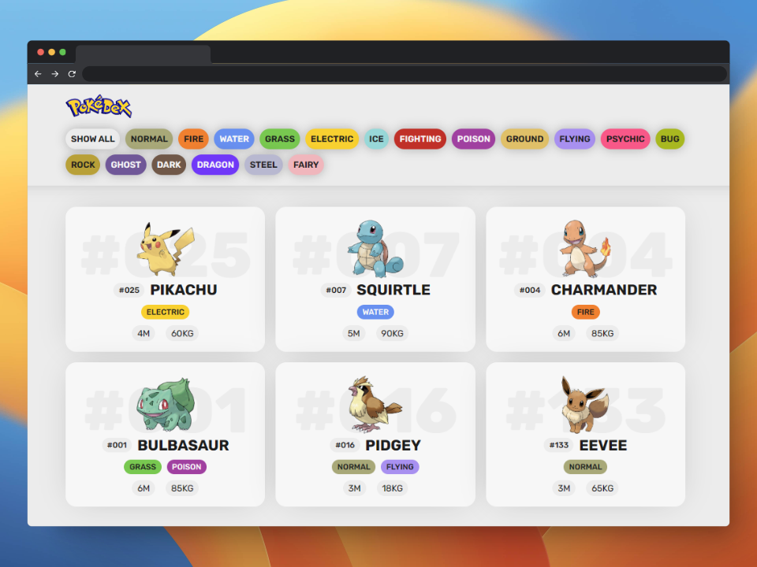

# pokedex-exercise-angular


**Pokedex Exercise Angular** es una aplicación Pokédex desarrollada en Angular con el objetivo de proporcionar una experiencia educativa y entretenida para los amantes de los Pokémon. Con esta aplicación, puedes explorar el fascinante mundo de los Pokémon y obtener información detallada sobre sus habilidades y características únicas.

<p align="center">  </p>

## Estado de Desarrollo

⚠️ **Este proyecto está en fase de desarrollo y estoy trabajando en mejoras constantes.** Si encuentras algún error o tienes sugerencias, no dudes en informarme abriendo un [issue](https://github.com/notyel/pokedex-exercise-angular/issues).

También estoy emocionado por las nuevas características que planeo agregar en el futuro, así que ¡mantente atento a las actualizaciones!

## Estructura del Proyecto

El repositorio tiene la siguiente estructura de carpetas:
- `design-html`: Contiene el diseño HTML del proyecto.
- `pokedex-app`: La aplicación Angular.

## Características Principales

- **Exploración de Pokémon**: Navega por una amplia variedad de Pokémon y descubre sus detalles esenciales, como su nombre, tipo, altura y peso.

- **Carga Dinámica**: Implementamos una carga dinámica desde la API pública [pokeapi.co](https://pokeapi.co/api/v2), lo que significa que puedes explorar una gran cantidad de Pokémon sin cargar todos los datos de una vez.

- **Scroll Infinito**: ¡No te preocupes por cargar más Pokémon manualmente! Hemos incluido una función de scroll infinito que te permite cargar automáticamente más Pokémon a medida que desplazas la página hacia abajo.

- **Carga Perezosa**: Mejoramos la eficiencia de la aplicación con la carga perezosa, lo que significa que los recursos se cargan según sea necesario, proporcionando una experiencia de usuario fluida.

- **Pikachu como Loader**: Hemos añadido un toque de diversión con un simpático Pikachu corriendo como loader mientras se cargan los datos. ¡Te encantará!

- **Detección de Imágenes SVG**: Detectamos automáticamente si una imagen es un archivo SVG y aplicamos estilos personalizados para garantizar una presentación adecuada.

- **Estructura Modularizada**: La aplicación sigue una estructura modularizada en componentes y servicios para facilitar el desarrollo y el mantenimiento.

## Uso

Para ejecutar la aplicación, sigue estos pasos:

1. Clona el repositorio:

   ```shell
   git clone https://github.com/tu-usuario/pokedex-exercise-angular.git
   ```

2. Navega al directorio de la aplicación:

   ```shell
   cd pokedex-exercise-angular/pokedex-app
   ```

3. Instala las dependencias:

   ```shell
   npm install
   ```

4. Inicia la aplicación:

   ```shell
   ng serve
   ```

5. Abre tu navegador y accede a [http://localhost:4200/](http://localhost:4200/) para explorar la Pokédex.

## Contribución

Si deseas contribuir a este proyecto, por favor sigue estos pasos:

1. Haz un fork del repositorio.
2. Crea una rama para tu contribución: `git checkout -b mi-contribucion`.
3. Realiza tus cambios y realiza un commit: `git commit -m "Añade nuevas características"`.
4. Sube tus cambios a tu repositorio: `git push origin mi-contribucion`.
5. Abre una solicitud de extracción (Pull Request) en el repositorio original.

## Licencia

Este proyecto está bajo la Licencia MIT. Consulta el archivo [LICENSE](LICENSE) para obtener más detalles.

---

Hecho con ❤️ por Leyton Manuel Espitia Diaz | [Github](https://github.com/notyel)
